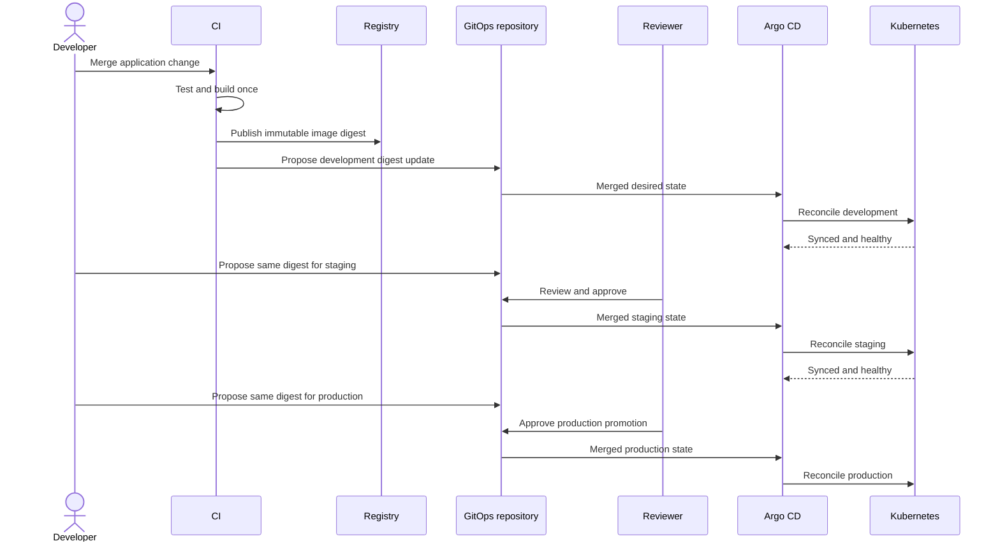

# Environment Promotion Contract

This contract defines how one verified application artifact moves through
development, staging, and production without being rebuilt or deployed
imperatively by CI.

## Release Identity

A release is identified by an OCI image digest:

```text
ghcr.io/example/payments-api@sha256:<content-digest>
```

The digest is the promotion identity. Human-readable tags may be attached for
discovery, but environment configuration must not use a mutable tag such as
`latest`, `main`, or `v1` as the deployment identity.

## Promotion Invariants

Every promotion must preserve these rules:

1. The image is built once and promoted without rebuilding.
2. Development, staging, and production reference the same digest for a given
   release.
3. CI may propose a desired-state change but cannot deploy directly.
4. Every staging and production change is represented by a pull request.
5. Required validation must pass before merge.
6. Production requires explicit approval from an authorized reviewer.
7. Argo CD reconciles only merged configuration from the protected `main`
   branch.
8. Plaintext credentials never enter the repository.
9. Manual cluster changes do not become the desired state.
10. Rollback selects a previously approved digest through Git history.

## Environment State

Each environment overlay declares the release digest explicitly:

```yaml
apiVersion: kustomize.config.k8s.io/v1beta1
kind: Kustomization
images:
  - name: ghcr.io/example/payments-api
    newName: ghcr.io/example/payments-api
    digest: sha256:<content-digest>
```

Environment overlays may change replicas, resource limits, ingress hostnames,
or environment-specific configuration. They must not change the application
binary associated with a promoted release.

## Promotion Gates

| Transition            | Required evidence                                                              | Approval                       | Result after merge                              |
| --------------------- | ------------------------------------------------------------------------------ | ------------------------------ | ----------------------------------------------- |
| Build → Development   | Source tests, image build, digest publication, manifest validation             | Automated                      | Development overlay references the new digest   |
| Development → Staging | Development is synced and healthy; the digest matches the build record         | Environment reviewer           | Staging references the exact development digest |
| Staging → Production  | Staging is synced and healthy; policy checks pass; change impact is documented | Authorized production reviewer | Production references the exact staging digest  |

An implementation may add stronger gates, but it must not bypass these minimum
controls.

## Promotion Sequence



## Validation Contract

Before an environment change can merge, automation will verify:

- YAML and Kustomize rendering succeeds.
- Required namespaces and labels are present.
- Workloads define resource requests and limits.
- Containers use supported security settings.
- Environment overlays reference image digests.
- A staging digest already exists in development.
- A production digest already exists in staging.
- Argo CD application and project manifests match the allowed repository and
  destination boundaries.

## Drift Contract

Git is authoritative. If a live resource differs from the rendered desired
state, Argo CD reports the application as out of sync and self-healing restores
the approved configuration.

The demonstration will introduce a safe manual replica change and show Argo CD
returning the workload to the replica count stored in Git.

## Rollback Contract

A standard rollback is a Git operation:

1. Identify the last known-good environment commit and image digest.
2. Revert the promotion commit or submit a pull request restoring that digest.
3. Run the same validation and approval controls used for a forward promotion.
4. Merge the change.
5. Allow Argo CD to reconcile and verify the application is synced and healthy.

An emergency change may use an accelerated approval path, but the desired state
must still be committed to Git. Direct cluster mutation is temporary and will
otherwise be reversed by self-healing.

## Ownership

| Responsibility                                  | Accountable party                             |
| ----------------------------------------------- | --------------------------------------------- |
| Application correctness and release readiness   | Application team                              |
| Template, overlay, and validation compatibility | Platform team                                 |
| Staging acceptance                              | Environment owner                             |
| Production approval                             | Authorized production reviewer                |
| Reconciliation availability and policy          | Platform operations                           |
| Runtime health and incident response            | Shared between application and platform teams |
