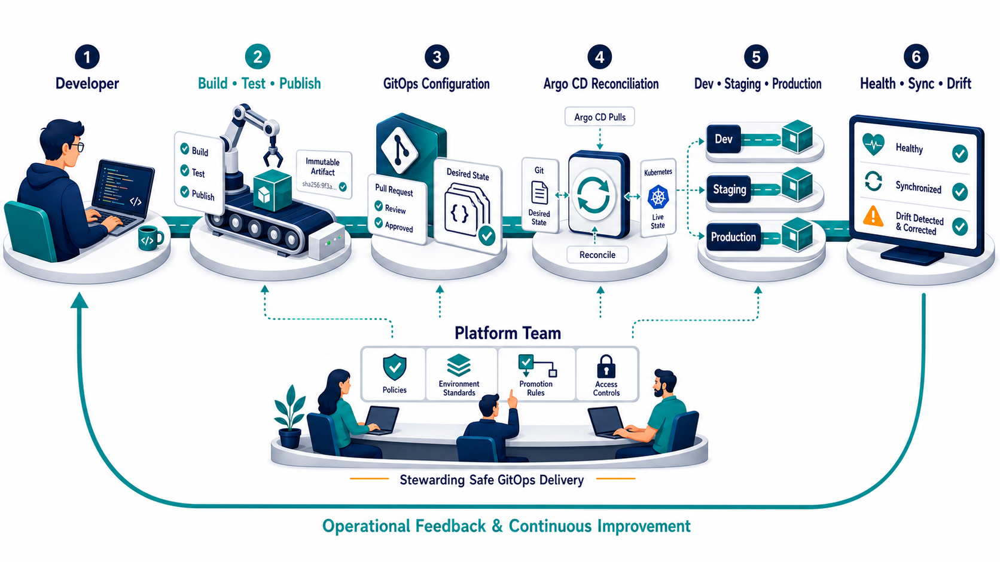

# Reference Architecture

This architecture separates application creation, release approval, and
runtime reconciliation so each responsibility has an explicit control point.

## System Context

The GitOps configuration repository is this project. It records the approved
desired state; it does not contain application source code, mutable image tags,
or plaintext credentials.

## Repository Boundaries

| Boundary                        | Owns                                                                                     | Must not own                                            |
| ------------------------------- | ---------------------------------------------------------------------------------------- | ------------------------------------------------------- |
| Application source repository   | Business code, unit tests, application build, container definition                       | Environment credentials or direct production deployment |
| OCI registry                    | Content-addressed application images and provenance                                      | Environment configuration                               |
| GitOps configuration repository | Environment composition, immutable image digests, Argo CD applications, and policy       | Application source or plaintext secrets                 |
| Cluster bootstrap               | Argo CD installation, repository connection, cluster registration, and local credentials | Application release decisions                           |
| Runtime environment             | Reconciled Kubernetes resources and operational status                                   | Undocumented desired-state changes                      |

The separation allows application CI to publish an artifact and propose a
configuration change without receiving credentials that can modify a runtime
cluster.

## Environment Topology

The local reference implementation uses one `kind` cluster with isolated
namespaces to keep the demonstration reproducible on a developer workstation.

| Logical environment | Namespace      | Promotion gate               | Reconciliation                                   |
| ------------------- | -------------- | ---------------------------- | ------------------------------------------------ |
| Development         | `apps-dev`     | Automated validation         | Automatic sync, prune, and self-heal             |
| Staging             | `apps-staging` | Reviewed pull request        | Automatic sync after merge, prune, and self-heal |
| Production          | `apps-prod`    | Explicit production approval | Automatic sync after merge, prune, and self-heal |

For organizational adoption, production should normally use a separate
cluster, cloud account, or equivalent failure and identity boundary. The
environment contract remains the same when the local namespaces are replaced
with independent clusters.

## Argo CD Control Model

Argo CD runs in the `argocd` namespace and continuously compares the rendered
desired state in Git with live Kubernetes resources.

The implementation will use:

- One `AppProject` to constrain allowed source repositories, destinations, and
  resource kinds.
- An `ApplicationSet` to generate one application per environment from
  version-controlled definitions.
- Kustomize bases for shared application behavior and overlays for explicit
  environment differences.
- Automated sync after an approved Git change is merged.
- Pruning to remove resources deleted from the desired state.
- Self-healing to reverse out-of-band drift.

Argo CD performs reconciliation only. It does not choose which image should be
promoted, approve production, or build artifacts.

## Trust Model

| Principal                      | Granted capability                                         | Explicit restriction                               |
| ------------------------------ | ---------------------------------------------------------- | -------------------------------------------------- |
| Developer                      | Change application source and propose a release            | No direct production cluster mutation              |
| Application CI                 | Test, build, publish an image, and propose a digest update | No Kubernetes deployment credentials               |
| Environment reviewer           | Approve a change to the desired state                      | Cannot replace required automated checks           |
| Git hosting platform           | Protect `main`, record reviews, and retain history         | Does not reconcile the cluster                     |
| Argo CD repository service     | Read approved configuration and render manifests           | No permission to modify Git                        |
| Argo CD application controller | Reconcile approved resources to allowed destinations       | Restricted by `AppProject` and cluster RBAC        |
| Kubernetes runtime             | Run the declared workload and report health                | Manual changes are not authoritative desired state |
| Registry                       | Serve the approved image by digest                         | Tags are not accepted as promotion identity        |

## Secret Boundary

Plaintext secrets are outside the desired-state repository. The local
implementation may create bootstrap credentials imperatively for demonstration
purposes, and those files remain Git-ignored. A production adoption should
integrate an external secret manager or encrypted-secret workflow without
changing the promotion contract.

## Failure and Recovery Behavior

| Condition                      | Expected behavior                                                                                 |
| ------------------------------ | ------------------------------------------------------------------------------------------------- |
| Git is temporarily unavailable | Existing workloads continue running; reconciliation resumes when Git returns                      |
| Registry is unavailable        | Existing pods continue; new pulls may fail and surface degraded health                            |
| Argo CD is unavailable         | Workloads continue; new desired-state changes wait for reconciliation                             |
| Manual cluster edit            | Argo CD reports drift and restores the approved state                                             |
| Invalid desired state          | Validation blocks merge or Argo CD reports a failed sync without redefining the approved artifact |
| Bad approved release           | Revert the environment change in Git and reconcile the known-good digest                          |

## Architecture Decisions

1. **One main branch, environment directories.** Pull requests show promotions
   as explicit changes without maintaining long-lived environment branches.
2. **Image digests, not mutable tags.** The promoted artifact is content
   addressable and identical across environments.
3. **Pull request before production.** Approval occurs in Git before Argo CD
   receives a new desired state.
4. **Automatic reconciliation after merge.** Git approval is the deployment
   gate; a second imperative deployment step is unnecessary.
5. **Namespace isolation locally, cluster isolation by adoption.** The local
   model remains lightweight while preserving a production-ready boundary
   contract.
6. **No CI cluster credentials.** Artifact creation and runtime mutation remain
   separate trust domains.

## References

- [Argo CD architectural overview](https://argo-cd.readthedocs.io/en/stable/operator-manual/architecture/)
- [Argo CD automated sync policy](https://argo-cd.readthedocs.io/en/stable/user-guide/auto_sync/)
- [Argo CD ApplicationSet](https://argo-cd.readthedocs.io/en/stable/operator-manual/applicationset/)
- [Argo CD projects](https://argo-cd.readthedocs.io/en/stable/user-guide/projects/)
- [Kubernetes container images](https://kubernetes.io/docs/concepts/containers/images/)
